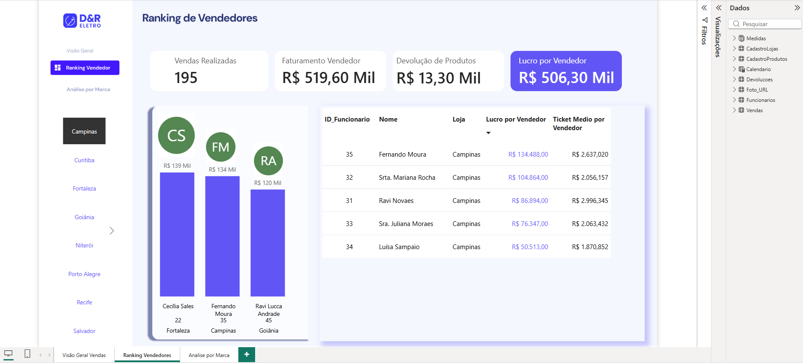
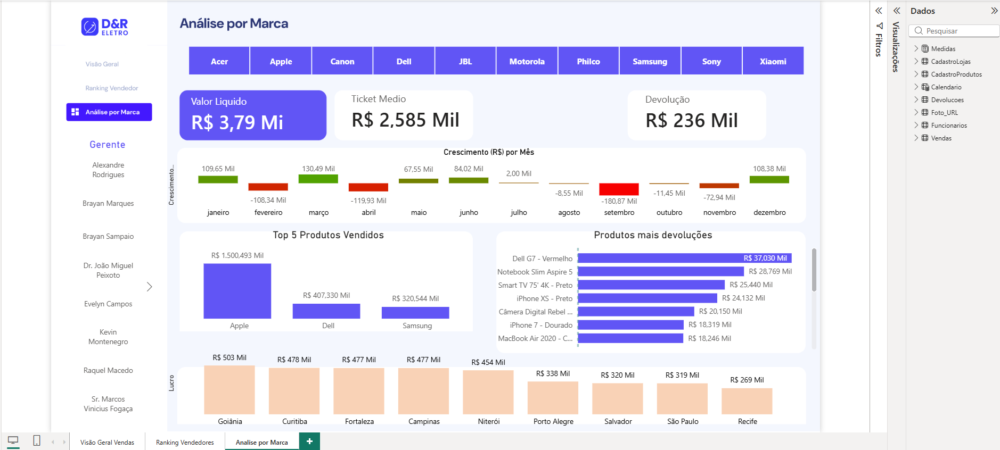
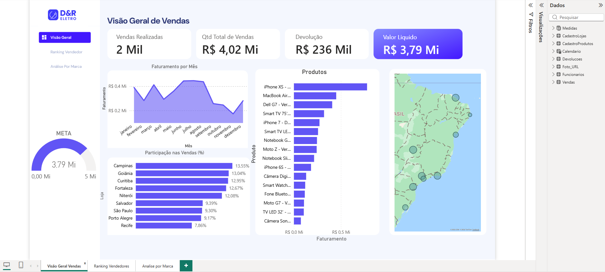

# dashboard-analise-dados-vendas
Dashboard desenvolvido em Power BI para análise de desempenho de uma rede de lojas de eletrônicos.

# 📊 Dashboard de Análise – Rede de Lojas de Eletrônicos

## 📌 Sobre o Projeto

Este projeto simula o funcionamento de uma rede de lojas de eletrônicos composta por 9 unidades distribuídas em diferentes regiões do Brasil, como São Paulo, Fortaleza e Curitiba.
A rede comercializa produtos como Smartphones, Notebooks, TV’s e Câmeras. Cada loja possui um Gerente responsável e 5 vendedores, que registram diariamente as vendas realizadas. Eventuais devoluções também são registradas e validadas pelos Gerentes.

Para estruturar e analisar essas informações, foram criadas três bases de dados fictícias:
- Funcionários  
- Vendas  
- Devoluções  
A partir dessas bases, foi realizado o tratamento, organização e modelagem dos dados no Excel e Power BI.

## 🛠 Ferramentas Utilizadas

- Excel (estruturação e organização das bases)
- Power BI (modelagem de dados e criação de dashboards)
- Criação de medidas e indicadores
- Relacionamento entre tabelas

## 📊 Análises Desenvolvidas

- Desempenho das lojas por região  
- Performance individual dos vendedores  
- Produtos mais vendidos  
- Análise de devoluções  
- Indicadores gerais de faturamento  

## 🎯 Objetivo Analítico

Transformar dados operacionais em indicadores visuais e estratégicos, permitindo a análise de desempenho das lojas, dos produtos e da equipe, auxiliando na tomada de decisão.

## 📷 Visualização do Dashboard

### Ranking de Vendedores

### Análise por Marca

### Visão Geral de Vendas

## Insights

Visão Geral de Vendas
Faturamento líquido de R$ 3,79 Mi com 2 mil vendas realizadas e devoluções controladas (R$ 236 Mil). Campinas lidera a participação regional (13,55%) e o iPhone XS é o produto mais faturado.

Ranking de Vendedores
Campinas domina o top 5, com Fernando Moura na liderança (R$ 134.488 de lucro). Há uma diferença de quase 3x entre o 1º e o 5º colocado, indicando oportunidade de desenvolvimento para os demais vendedores.

Análise por Marca
Apple, Dell e Samsung concentram a maior parte da receita. Há queda de vendas entre maio e setembro, sugerindo sazonalidade. O Dell GT - Vermelho é o produto com maior volume de devoluções, ponto de atenção para investigação.
